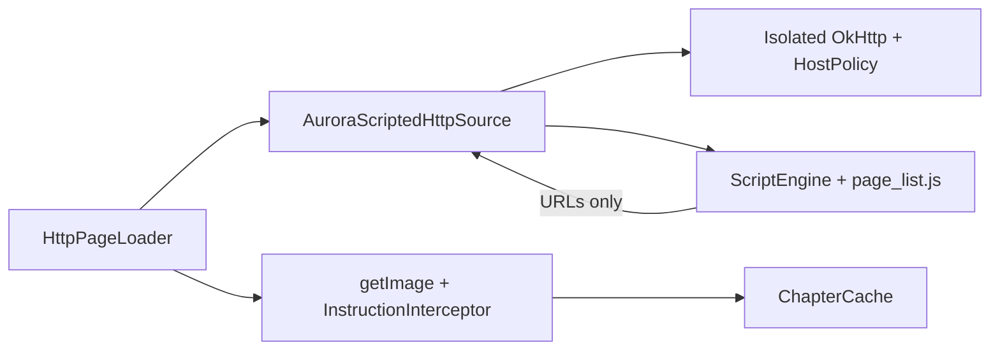

# AuroraReader ScriptedSource S1 Design

> **Status:** Approved in chat 2026-08-02 (竖切 S1 + 方案 A)  
> **Date:** 2026-08-02  
> **Repos:** AuroraReader-mihon (host) · AuroraExtensions (demo extension + protocol) · AuroraReader/source-lab (out of S1 code path)

## 1. Goal

Deliver a **vertical slice** where a Mihon-compatible Aurora extension uses **embedded JavaScript only to discover chapter image URLs**, while **Kotlin + OkHttp** perform all network I/O under host policy and download instructions. The reader path stays the stock Mihon `HttpPageLoader` flow.

Success for S1: install a **Aurora Scripted demo** extension → open a fixed demo chapter → at least **one image** renders in the reader, with unit tests for policy/interceptor and a written protocol doc.

## 2. Vertical slice (S1)

| Surface | Owner in S1 |
|---------|-------------|
| `getPopularManga` / `getSearchManga` / manga detail / chapter list | **Kotlin only** (fixture or minimal static demo site) |
| `getPageList` / image URL discovery | **JS** via `ScriptEngine` |
| Image bytes download | **Kotlin OkHttp** + `DownloadInstructionInterceptor` on an **isolated** client |
| Covers / unrelated sources | Unchanged Mihon / existing Stub + MangaDex |

Explicitly **not** S1: JS-driven popular/search/detail/chapters (that is S2); host-hosted JS engine (rejected approach B); Instruction-only without JS (rejected approach C).

## 3. Approach (locked)

**Approach A — self-contained demo extension**

- Package a lightweight JS engine (QuickJS or equivalent Android-friendly embed) + `assets/*.js` inside the extension APK.
- Ship `DownloadInstruction` / `HostPolicy` / interceptor as a **thin shared module** (or source-copied library) consumed by the demo extension.
- Do **not** change default `NetworkHelper.client`, `ExtensionLoader`, or `tachiyomix` semantics.
- Keiyoushi / community `HttpSource` extensions remain unaware of ScriptedSource.

## 4. Architecture

```text
Reader → HttpPageLoader
  → AuroraScriptedHttpSource.getPageList(chapter)
       → Kotlin GET chapter.url  (isolated OkHttp client + HostPolicy)
       → ScriptEngine.call("pageList", { html, chapterUrl, baseUrl })
       → JS returns { pages[], allowedHosts? }
       → Kotlin validates URLs / HostPolicy → List<Page>
  → HttpPageLoader.getImage
       → imageRequest + DownloadInstructionInterceptor
       → ChapterCache → Viewer
```

**Hard rule:** JS never opens sockets. It only returns URLs and optional safe header suggestions.



## 5. Components and placement

| Component | Location |
|-----------|----------|
| `DownloadInstruction` data model | `AuroraExtensions` thin module e.g. `scripted-core` (or `lib/scripted`) |
| `HostPolicy` (ported concept from legacy AuroraReader) | same module |
| `DownloadInstructionInterceptor` + image MIME allowlist | same module |
| `ScriptEngine` wrapper | demo extension |
| `AuroraScriptedHttpSource : HttpSource` | demo extension package e.g. `eu.kanade.tachiyomi.extension.all.aurorascripted` |
| `assets/page_list.js` | demo extension assets |
| Protocol doc | `AuroraExtensions/docs/SCRIPTED_SOURCE_PROTOCOL.md` |
| Index / APK publish | existing `AuroraExtensions/repo/` + `generate-repo.ps1` |
| Host app `AuroraReader-mihon` | **no changes required for S1** (regression only: Stub/MangaDex still work) |
| `source-lab scaffold --mode scripted` | **out of S1** (document as follow-up) |

Legacy code to **port ideas from** (not wire Contract):

- `HostPolicy` — same-host check; S1 extends with explicit `allowedHosts` from JS result / instruction
- Image MIME allowlist concept from `SourceImageInterceptor` / `ImageMimePolicy`
- **Do not** migrate Source Contract, ExecutionEngine, ParserPipeline, or ContractTestRunner as runtime

## 6. DownloadInstruction protocol (v1)

### 6.1 JS → Kotlin (`pageList` result)

```json
{
  "pages": [
    {
      "imageUrl": "https://example.com/1.jpg",
      "headers": { "Referer": "https://example.com/" }
    }
  ],
  "allowedHosts": ["cdn.example.com"]
}
```

| Field | Required | Rules |
|-------|----------|--------|
| `pages` | yes | Non-empty array for a successful chapter; each entry needs `imageUrl` |
| `pages[].imageUrl` | yes | `http` or `https` only |
| `pages[].headers` | no | Safe headers only; see denylist |
| `allowedHosts` | no | Extra hosts permitted for image URLs beyond `baseUrl` host |

### 6.2 Host policy

1. Scheme must be `http` or `https`.
2. Default allowed host = host of extension `baseUrl`.
3. Image URL host must equal `baseUrl` host **or** appear in `allowedHosts` (case-insensitive).
4. On any page violating policy: **fail the whole chapter** (no partial dirty `Page` lists).

### 6.3 Header denylist

Never apply from JS or instruction context:

- `Cookie`
- `Authorization`
- `Proxy-Authorization`

(Case-insensitive name match.)

### 6.4 Response MIME

Interceptor rejects responses whose `Content-Type` is not an allowed image type (mirror legacy allowlist intent: e.g. `image/jpeg`, `image/png`, `image/webp`, `image/gif`, and common prefixed variants). Non-image → fail that image load.

### 6.5 Kotlin → JS (`pageList` input)

```json
{
  "html": "<html>...</html>",
  "chapterUrl": "https://example.com/chapter/1",
  "baseUrl": "https://example.com"
}
```

Engine exposes a single entry, e.g. global function or exported `pageList(inputJson) -> resultJson`. Exact binding name is an implementation detail fixed in the protocol doc when the engine is chosen.

## 7. Demo source behavior (Kotlin surfaces)

- Provide a **deterministic** popular list with one (or few) manga entries.
- Detail + chapter list point at HTML that the page-list script can parse (bundled fixture served via MockWebServer in tests; on device, either embedded asset-backed local server **or** a committed static HTTPS fixture host under Aurora control).
- Preferred device path for S1: chapter HTML fetched from a **known public demo URL under `baseUrl`** that returns stable HTML without login/CAPTCHA; if none is available at implementation time, use **extension-bundled HTML** loaded without network for the chapter document and only fetch images from allowed hosts (document the chosen option in the phase report).
- Decision locked for ambiguity: **implementation may use bundled chapter HTML** for the document step if no stable public demo page exists, as long as **image download still goes through OkHttp + interceptor**.

## 8. Script engine constraints

- Runs inside the extension process/classloader.
- No filesystem write, no arbitrary reflection bridge beyond the JSON in/out API provided by `ScriptEngine`.
- Timeout: configurable, default **5s** wall clock per `pageList` call; on timeout → chapter load failure.
- Engine library choice: prefer a maintained QuickJS Android binding; pin version in Gradle; document APK size impact in the phase report.

## 9. Errors and safety

| Condition | Behavior |
|-----------|----------|
| JS throw / invalid JSON | Chapter load failure; log message |
| Empty `pages` | Chapter load failure |
| Host policy violation | Chapter load failure (whole chapter) |
| Non-image MIME | That image request fails (reader error for page) |
| Login / CAPTCHA / paywall / DRM detected | Do not bypass; mark unsupported or fail; demo source must avoid these |

Safety product rules remain absolute: no login cracking, CAPTCHA bypass, paywall bypass, or DRM bypass.

## 10. Testing and acceptance

### Unit / JVM

- `HostPolicy` allow/deny (base host, allowedHosts, bad scheme)
- `DownloadInstructionInterceptor` (header denylist, host deny, MIME deny) with MockWebServer
- `ScriptEngine` + sample `page_list.js` against fixture HTML → expected URLs

### Device

1. Install demo scripted extension from AuroraExtensions (HTTPS index).
2. Open demo manga → chapter → **≥1 image** visible.
3. Regression: Stub and MangaDex still install and function.

### Docs

- `AuroraExtensions/docs/SCRIPTED_SOURCE_PROTOCOL.md` matches §6.

## 11. Out of scope

- Host changes to Reader / `HttpPageLoader` special-cases
- Changing default `NetworkHelper` interceptor chain
- Reviving Source Contract / ExecutionEngine as primary runtime
- Lab `scaffold --mode scripted` CLI (follow-up)
- Phase 7 extension health / fixture CI (separate track)
- Community repo mirroring or NSFW expansion
- S2 full JS catalogue surface

## 12. Risks

| Risk | Mitigation |
|------|------------|
| Touching default OkHttp breaks community extensions | Isolated client only |
| JS sandbox escape / cross-host instructions | JSON-only API + HostPolicy + header denylist |
| Strict same-host blocks CDN | `allowedHosts` in protocol |
| Engine bloat / linking issues | Pin dependency; keep stdlib out of extension APK as with Stub lessons |
| CloudflareInterceptor interaction | Prefer not stacking CF interceptor on scripted image client unless proven needed |

## 13. Compatibility baseline

- Do not change `ExtensionLoader` or extension-lib public contracts.
- Standard `HttpSource` default behavior unchanged.
- Existing Aurora Stub + MangaDex packages remain in the repo index alongside the new demo.

---

## Approval record

- Architecture analysis: 2026-08-01 (read-only)
- Vertical slice: **S1**
- Packaging approach: **A** (self-contained extension)
- Design approved by user: **2026-08-02**
